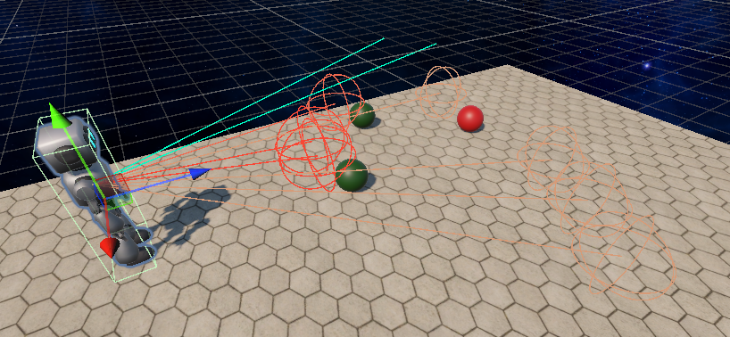

# **Reinforcement Learning with Unity ML-Agents**

This project demonstrates the use of **Proximal Policy Optimization (PPO)** to train an agent in a Unity environment. The agent interacts with the environment, learns from rewards, and improves its behavior over time. Key highlights of the project include:

- **Unity ML-Agents Integration**: The Unity environment is used to simulate a 3D world where the agent performs actions and receives rewards.
- **Reinforcement Learning Algorithms**: PPO is implemented to train the agent effectively.
- **Custom Reward System**: The reward system is designed to encourage desired behaviors such as collecting green spheres, avoiding red spheres, and preventing falls.
- **Evaluation and Visualization**: The agent's performance is evaluated over multiple episodes, and results are visualized with trend lines to track progress.

This project serves as a practical example of combining Unity simulations with TensorFlow-based reinforcement learning to solve complex tasks.

---

## **Environment Overview**

The Unity environment simulates a 3D world where the agent operates. The environment contains:
- **Green Spheres**: Represent positive rewards. The agent is encouraged to collect these.
- **Red Spheres**: Represent negative rewards. The agent is penalized for collecting these.
- **Boundaries**: The agent must avoid falling off the platform.

At the start of an episode:
- The agent spawns at a random position on the platform.
- **80 spheres** are randomly spawned on the platform, with each sphere having a **2/3 probability of being green** and a **1/3 probability of being red**.

### **Goals of the Agent**
The agent's primary objectives are:
1. **Collect Green Spheres**: Maximize rewards by collecting as many green spheres as possible.
2. **Avoid Red Spheres**: Minimize penalties by avoiding red spheres.
3. **Prevent Falls**: Stay within the platform boundaries to avoid large penalties.

---
### **Agent's Observations**

The agent's observations include its **position**, **rotation**, and **velocity**.

Additionally, the agent is equipped with **3D ray sensors** to perceive its surroundings. These sensors detect:
- **Green Spheres**: Positive rewards.
- **Red Spheres**: Negative rewards.
- **The Platform**: To avoid falling off.

These observations enable the agent to make informed decisions and interact effectively with the environment. For a more detailed explanation of the agent's observation space, refer to the accompanying **notebook**.

---

### **Agent's Actions**

The agent operates in a discrete action space, where it can perform the following actions:
1. **Do Nothing**: The agent remains stationary.
2. **Move Right**: The agent moves to the right.
3. **Move Left**: The agent moves to the left.
4. **Move Forward**: The agent moves forward.
5. **Move Backward**: The agent moves backward.

---

### **Episode Termination**

An episode in the environment ends under the following conditions:

1. **Falling Off the Platform**:  
   - If the agent moves outside the platform boundaries, the episode terminates immediately. This results in a significant penalty to discourage such behavior.

2. **Timer Expiry**:  
   - Each episode has a maximum duration of **40 seconds**. If the timer runs out, the episode ends, and the agent's performance is evaluated based on the rewards accumulated during the episode.

---

## **Why PPO?**

Proximal Policy Optimization (PPO) was chosen for this project due to its balance between simplicity and performance. PPO is well-suited for environments with discrete action spaces such as this one.

---

### **Video Example**

The video above demonstrates the agent's behavior after training. The agent successfully collects green spheres, avoids red spheres, and stays within the platform boundaries.

---

## **Future Improvements**

While the agent performs decently, there are areas for improvement:
- **Better Handling of Close Proximity**: Improve the agent's decision-making when green and red spheres are close together.
- **Exploration in Empty Areas**: Encourage the agent to explore when no green spheres are detected.

---

This project highlights the potential of reinforcement learning in solving complex tasks within simulated environments. Feel free to explore, modify, and extend the project to suit your needs.